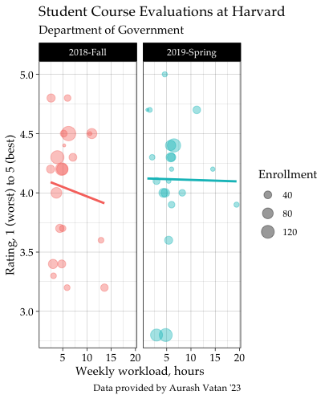

<!-- README is generated from README.Rmd, edit ONLY this file if needed. But, after you edit it, you NEED TO KNIT IT BY HAND in order to create the new README.md, which is the thing which is actually used. -->

# Data for *Preceptor’s Primer for <br/> Bayesian Data Science* 

## About this package

`PPBDS.data` provides the data and the tutorials used in *[Preceptor’s
Primer for Bayesian Data Science](https://davidkane9.github.io/PPBDS/)*,
the textbook used in [Gov 50:
Data](https://www.davidkane.info/files/gov_50_fall_2020.html) at Harvard
University.

<!-- unsure if badges are available for use yet here -->

## Installation

As this package is not released on CRAN, you must install it directly
from GitHub.

``` r
remotes::install_github("davidkane9/PPBDS.data")
```

## Loading Preceptor’s Data

After installing the package, it loads as any package should.

``` r
library(tidyverse) 
library(PPBDS.data)

qscores
#> # A tibble: 748 x 8
#>    name             department number term   enrollment hours rating instructor 
#>    <chr>            <chr>      <chr>  <chr>       <int> <dbl>  <dbl> <chr>      
#>  1 Introduction to… AFRAMER    100Y   2019-…         49   2.6    4.2 Jesse McCa…
#>  2 American Democr… AFRAMER    123Z   2019-…         49   3.6    4.4 Cornel West
#>  3 Urban Inequalit… AFRAMER    125X   2019-…         40   5.2    4.5 Elizabeth …
#>  4 Richard Wright   AFRAMER    130X   2019-…         23   7.2    4.4 Glenda Car…
#>  5 19th century Bl… AFRAMER    131Y   2019-…         20   3.5    4.9 Linda Chav…
#>  6 Social Revoluti… AFRAMER    199X   2019-…         19   7.2    4.8 Alejandro …
#>  7 Martin Luther K… AFRAMER    199Y   2019-…         40   4.2    4.7 Brandon Mi…
#>  8 Elementary Afri… AFRIKAAN   AB     2019-…         22   2.9    4.9 John M Mug…
#>  9 Elementary Jama… JAMAICAN   AB     2019-…         18   1.5    4.9 John M Mug…
#> 10 Elementary West… WSTAFRCN   AB     2019-…         29   2.6    4   John M Mug…
#> # … with 738 more rows
```

## Using the data

Once the library is loaded and you have confirmed that it can be
accessed in your local environment, the data sets can be called as
objects and used like any other data you would otherwise read in and
assign to an object manually. See the following example of a plot using
`PPBDS.data::qscores`.

``` r

library(ggplot2)

qscores %>% 
  filter(department == "GOV") %>% 
  ggplot(aes(hours, rating, color = term)) +
    geom_point(aes(size = enrollment), alpha = 0.4) +
    geom_smooth(method = "lm", formula = y ~ x, se = FALSE) +
    facet_wrap(~term) +
    labs(
      title = "Student Course Evaluations at Harvard",
      subtitle = "Department of Government",
      caption = "Data provided by Aurash Vatan '23",
      x = "Weekly workload, hours",
      y = "Rating, 1 (worst) to 5 (best)",
      size = "Enrollment") +
    theme_linedraw() +
    theme(
        text = element_text(family = "Palatino"),
        axis.text.x = element_text(size = 10),
        axis.text.y = element_text(size = 10)) +
    scale_color_discrete(guide = "none")
```

<!-- DK: We need some comments explaining what this is doing and how we can replace it. Specifically, why place the figure in man/ rather than inst/? -->



## Citing PPBDS.data

``` r
citation("PPBDS.data")
#> 
#> To cite 'PPBDS.data' in publications use:
#> 
#>   David Kane. 2020. 'PPBDS.data'. R package version 0.1.0,
#>   <https://github.com/davidkane9/PPBDS.data>.
#> 
#> A BibTeX entry for LaTeX users is
#> 
#>   @Manual{,
#>     title = {PPBDS.data},
#>     author = {David Kane},
#>     year = {2020},
#>     url = {https://github.com/davidkane9/PPBDS.data},
#>   }
```
