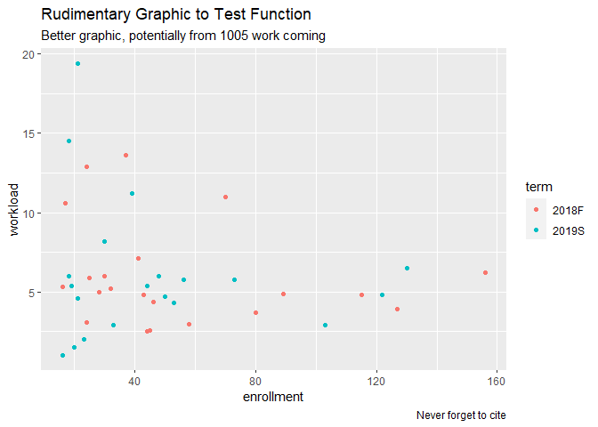

<!-- README is generated from README.Rmd, edit ONLY this file if needed. But, after you edit it, you NEED TO KNIT IT BY HAND in order to create the new README.md, which is the thing which is actually used. -->

# Data for *Preceptor’s Primer for <br/> Bayesian Data Science* 

## About this package

`PPBDS.data` provides the data and the tutorials used in *[Preceptor’s
Primer for Bayesian Data Science](https://davidkane9.github.io/PPBDS/)*,
the textbook used in [Gov 50:
Data](https://www.davidkane.info/files/gov_50_fall_2020.html) at Harvard
University.

<!-- unsure if badges are available for use yet here -->

## Installation

As this package is not released on CRAN, you must install it directly
from GitHub.

``` r
remotes::install_github("davidkane9/PPBDS.data")
```

In order to run these tutorials, you must install the
[learnrhash](https://github.com/rundel/learnrhash) package, created by
Colin Rundel.

``` r
remotes::install_github("rundel/learnrhash")
```

## Loading Preceptor’s Data

After installing the package, it loads as any package should.

``` r
library(tidyverse) 
library(PPBDS.data)

qscores
#> # A tibble: 748 x 8
#>    course_name department course_number term  enrollment hours rating instructor
#>    <chr>       <chr>      <chr>         <chr>      <int> <dbl>  <dbl> <chr>     
#>  1 " Introduc… AFRAMER    100Y          2019S         49   2.6    4.2 Jesse McC…
#>  2 " American… AFRAMER    123Z          2019S         49   3.6    4.4 Cornel We…
#>  3 " Urban In… AFRAMER    125X          2019S         40   5.2    4.5 Elizabeth…
#>  4 " Richard … AFRAMER    130X          2019S         23   7.2    4.4 Glenda Ca…
#>  5 " 19th cen… AFRAMER    131Y          2019S         20   3.5    4.9 Linda Cha…
#>  6 " Social R… AFRAMER    199X          2019S         19   7.2    4.8 Alejandro…
#>  7 " Martin L… AFRAMER    199Y          2019S         40   4.2    4.7 Brandon M…
#>  8 " Elementa… AFRIKAAN   AB            2019S         22   2.9    4.9 John M Mu…
#>  9 " Elementa… JAMAICAN   AB            2019S         18   1.5    4.9 John M Mu…
#> 10 " Elementa… WSTAFRCN   AB            2019S         29   2.6    4   John M Mu…
#> # … with 738 more rows
```

## Using the data

Once the library is loaded and you have confirmed that it can be
accessed in your local environment, the data sets can be called as
objects and used like any other data you would otherwise read in and
assign to an object manually. See the following example of a plot using
`PPBDS.data::qscores`.

``` r

library(ggplot2)

qscores %>%
  filter(department == "GOV") %>%
  ggplot(aes(y = workload, x = enrollment)) + 
  geom_point(aes(color = term)) + 
  labs(
    title = "Rudimentary Graphic to Test Function",
    subtitle = "Better graphic, potentially from 1005 work coming",
    caption = "Never forget to cite")
```

<!-- DK: We need some comments explaining what this is doing and how we can replace it. Specifically, why place the figure in man/ rather than inst/? -->



## Citing PPBDS.data

``` r
citation("PPBDS.data")
#> 
#> To cite 'PPBDS.data' in publications use:
#> 
#>   David Kane. 2020. 'PPBDS.data'. R package version 0.1.0,
#>   <https://github.com/davidkane9/PPBDS.data>.
#> 
#> A BibTeX entry for LaTeX users is
#> 
#>   @Manual{,
#>     title = {PPBDS.data},
#>     author = {David Kane},
#>     year = {2020},
#>     url = {https://github.com/davidkane9/PPBDS.data},
#>   }
```
